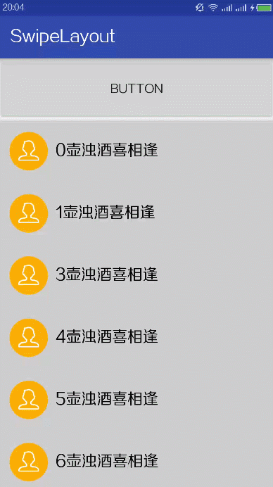

# SwipeLayout
侧滑删除，适用于任何 View。

> Github 上有一个非常著名的侧滑删除 [daimajia/AndroidSwipeLayout](https://github.com/daimajia/AndroidSwipeLayout)，但是我在使用的时候发现了一些 BUG。   
> 其他的侧滑删除大都又是与 ListView、RecyclerView 耦合在一起，不适用于目前的项目，于是有了这个小巧简洁的 SwipeLayout。

## 项目原理
使用 ViewDragHelper 和 ViewDragHelper.Callback 完成一系列的侧滑动作。

## 效果展示


## 使用说明

### 布局
布局分内容区域和删除区域，内容区域为正常展示数据的区域，删除区域是侧滑出来的区域。
```html
<com.ssyijiu.swipelayout.SwipeLayout
        android:id="@+id/swipelayout"
        android:layout_width="match_parent"
        android:layout_height="wrap_content"
        >
        <!--内容区域-->
        <include layout="@layout/layout_content"/>

        <!--删除区域-->
        <include layout="@layout/layout_delete"/>

</com.ssyijiu.swipelayout.SwipeLayout>
```

### 代码

```
// 在进入 Activity 或者 Fragmen t时候初始化 SwipeLayout
SwipeLayoutManager.getInstance().closeOpenInstance();

// 设置点击事件
swipelayou.setOnSwipeLayoutClickListener(new SwipeLayout.OnSwipeLayoutClickListener() {
    @Override
    public void onClick() {
        Toast.makeText(MainActivity.this, "BUTTON", Toast.LENGTH_SHORT).show();
    }
});

// 获取内容区域并设置点击事件
swipelayou.getContentView().setOnClickListener(new View.OnClickListener() {
    @Override
    public void onClick(View v) {
        Toast.makeText(MainActivity.this, "BUTTON", Toast.LENGTH_SHORT).show();
    }
});

// 获取删除区域并设置点击事件（因为这里删除区域是LinearLayout，包括一个callView和deleteView，需要自己获取子View来设置点击事件）
((LinearLayout)swipelayou.getDeleteView()).getChildAt(1).setOnClickListener(new View.OnClickListener() {
    @Override
    public void onClick(View v) {
        Toast.makeText(MainActivity.this, "DELETE", Toast.LENGTH_SHORT).show();
    }
});

// ListView侧滑打开的时候，通过监听滑动来关闭打开的侧滑。
// 这里没有想到其他的办法，如果您有思路，希望告知我。
listview.setOnScrollListener(new AbsListView.OnScrollListener() {
    @Override
    public void onScrollStateChanged(AbsListView view, int scrollState) {
        if(scrollState == AbsListView.OnScrollListener.SCROLL_STATE_TOUCH_SCROLL) {
            // 如果listView跟随手机拖动，关闭已经打开的SwipeLayout
            SwipeLayoutManager.getInstance().closeOpenInstance();
        }
    }

    @Override
    public void onScroll(AbsListView view, int firstVisibleItem, int visibleItemCount, int totalItemCount) {
    }
});
```
## 联系作者
- Github: [ssyijiu](https://github.com/ssyijiu)
- E-mail: lxmyijiu@163.com
- WeChat: ssyijiu11

## License

```
Copyright 2016 ssyijiu

Licensed under the Apache License, Version 2.0 (the "License");
you may not use this file except in compliance with the License.
You may obtain a copy of the License at

   http://www.apache.org/licenses/LICENSE-2.0

Unless required by applicable law or agreed to in writing, software
distributed under the License is distributed on an "AS IS" BASIS,
WITHOUT WARRANTIES OR CONDITIONS OF ANY KIND, either express or implied.
See the License for the specific language governing permissions and
limitations under the License.
```
